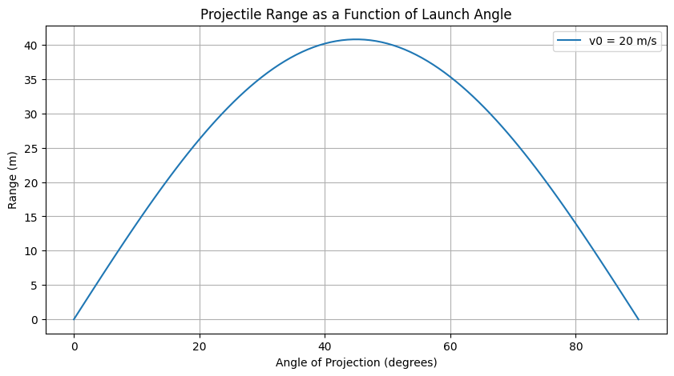
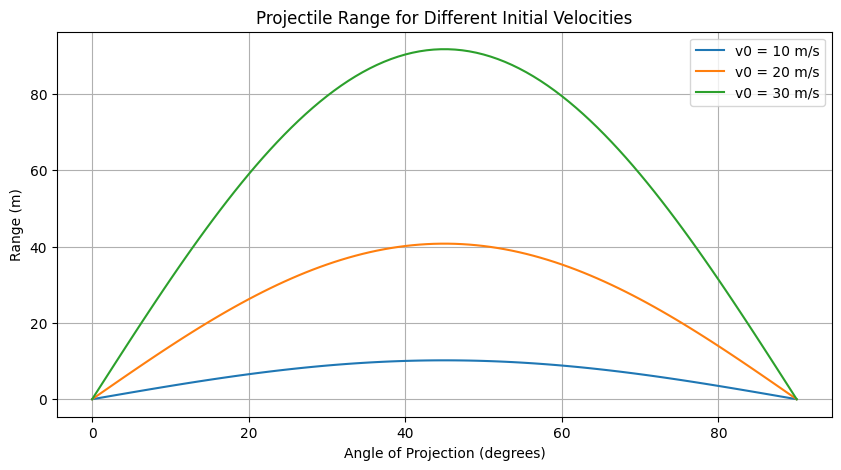
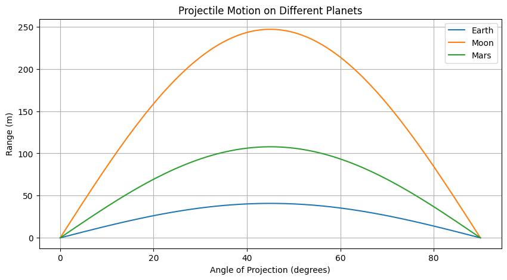
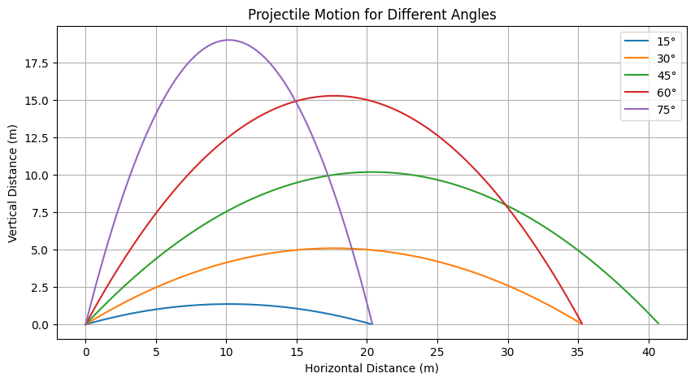
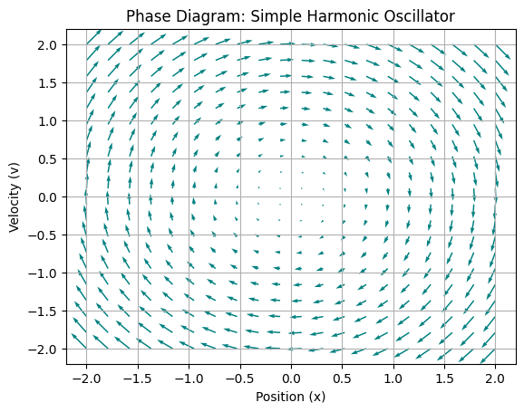

# Problem 1 
# The Range of a Projectile as a Function of the Angle of Projection

## 1. Introduction
Projectile motion, a fundamental concept in classical mechanics, describes the trajectory of an object launched into the air under the influence of gravity. While seemingly straightforward, this phenomenon reveals intricate relationships between various physical parameters, offering a rich context for exploring core principles of physics.

The motion of a projectile can be understood as a superposition of two independent motions: a uniform velocity in the horizontal direction and a uniformly accelerated motion due to gravity in the vertical direction. In idealized scenarios, where air resistance is neglected, the path traced by a projectile is a parabola. Understanding the factors that influence this motion is crucial, given its wide-ranging applications in fields such as sports, engineering, and even astrophysics. This report aims to investigate the relationship between the horizontal range of a projectile and its angle of projection, providing a comprehensive analysis grounded in fundamental physics and supported by computational simulations.

## 2. Governing Equations of Motion
To analyze projectile motion, we establish the governing equations that describe the object's movement based on Newton's laws of motion. Considering a projectile launched with an initial velocity \( v_0 \) at an angle \( \theta \) with respect to the horizontal and neglecting air resistance, the only force acting on the projectile is gravity \( g \), which acts vertically downward.

- Horizontal acceleration: \( a_x = 0 \)
- Vertical acceleration: \( a_y = -g \)

The velocity components are:
- \( v_x = v_0 \cos\theta \) (constant)
- \( v_y = v_0 \sin\theta - gt \)

The displacement components:
- \( x = v_0 t \cos\theta \)
- \( y = v_0 t \sin\theta - \frac{1}{2} g t^2 \)

Eliminating \( t \) from these equations yields the equation of the trajectory, showing a parabolic path.
## Differential Equations

## Newton’s Second Law of Motion

**Equation:**
$$
F = ma \quad \Rightarrow \quad m\frac{d^2x}{dt^2} = F(x, t)
$$

- Describes how a force causes acceleration.
- It's a second-order ordinary differential equation (ODE).

---

## Simple Harmonic Motion (Mass-Spring System)

**Equation:**
$$
m\frac{d^2x}{dt^2} + kx = 0
$$

- Models ideal spring oscillations.
- General solution: 
$$
x(t) = A\cos(\omega t) + B\sin(\omega t), \quad \omega = \sqrt{\frac{k}{m}}
$$

---

## Damped Harmonic Motion

**Equation:**
$$
m\frac{d^2x}{dt^2} + c\frac{dx}{dt} + kx = 0
$$

- Includes damping (e.g., friction or air resistance).
- Types:
  - **Overdamped**
  - **Critically damped**
  - **Underdamped**

---

## Forced Damped Oscillator

**Equation:**
$$
m\frac{d^2x}{dt^2} + c\frac{dx}{dt} + kx = F_0\cos(\omega t)
$$

- Oscillator under the influence of an external force.
- Resonance occurs when driving frequency matches natural frequency.

---

## Projectile Motion with Air Resistance

**Equation:**
$$
m\frac{dv}{dt} = -mg - kv
$$

- Motion under gravity with linear air resistance.
- Terminal velocity occurs when acceleration = 0.

---

## Pendulum Motion (Nonlinear)

**Exact Equation:**
$$
\frac{d^2\theta}{dt^2} + \frac{g}{L}\sin(\theta) = 0
$$

**Approximation (for small angles):**
$$
\frac{d^2\theta}{dt^2} + \frac{g}{L}\theta = 0
$$

- The full equation is nonlinear.
- The small-angle version behaves like simple harmonic motion.

## 3. Analysis of the Range
The horizontal range \( R \) is the total horizontal distance traveled before returning to \( y = 0 \):

- Time of flight: \( T = \frac{2 v_0 \sin\theta}{g} \)
- Range equation: \( R = \frac{v_0^2 \sin(2\theta)}{g} \)

### Range vs. Angle
| Launch Angle (°) | \( \sin(2\theta) \) | Range (m) (for \( v_0 = 20 \) m/s, \( g = 9.8 \) m/s²) |
|-----------------|----------------|----------------------------|
| 0               | 0              | 0 m                        |
| 15              | 0.5            | 20.4 m                     |
| 30              | 0.866          | 35.3 m                     |
| 45              | 1              | 40.8 m                     |
| 60              | 0.866          | 35.3 m                     |
| 75              | 0.5            | 20.4 m                     |
| 90              | 0              | 0 m                        |

The range is maximized at \( \theta = 45^\circ \).

## 4. Beyond the Ideal Model
### 4.1 Effect of Launch Height
If the projectile is launched from height \( y_0 > 0 \), the range equation is modified since the projectile remains in the air longer.

Using the vertical displacement equation:
\[ y = y_0 + v_0 \sin\theta t - \frac{1}{2} g t^2 \]
Setting \( y = 0 \), solving for \( t \), and substituting into \( x = v_0 \cos\theta t \) gives a more complex range formula.

### 4.2 Air Resistance (Drag)
Air resistance affects the projectile motion significantly:

| Feature | Without Air Resistance | With Air Resistance |
|---------|----------------------|----------------------|
| Trajectory | Parabola | Skewed curve |
| Range | Longer | Shorter |
| Max Height | Higher | Lower |
| Symmetry | Symmetrical | Asymmetrical (steeper descent) |
| Optimal Angle | 45° | Less than 45° |

Drag force depends on the projectile's speed, shape, and air density. Numerical methods are often required to solve motion equations with air resistance.

### 4.3 Wind Effects
Wind can cause:
- **Wind drift**: Lateral deviation due to crosswinds.
- **Headwind & Tailwind**: Affect projectile speed and range.

## 5. Practical Applications
### Sports
| Sport | Key Projectile Principle | Parameter Optimized |
|-------|------------------------|----------------------|
| Basketball | Launch angle for accuracy | Accuracy |
| Golf | Launch angle, velocity, spin | Distance, accuracy |
| Soccer | Launch angle, spin for trajectory | Accuracy, curve |
| Javelin | Launch angle for max distance | Range |
| Archery | Launch angle for hitting target | Accuracy |
| Football | Launch angle for hang time/distance | Time of flight, distance |

### Engineering
Projectile motion applies to ballistics, robotics, game physics, and fireworks design.

### Astrophysics
Projectile motion principles extend to celestial mechanics, such as meteors and spacecraft maneuvers.

## 6. Computational Simulation
Using Python with `NumPy` and `Matplotlib`, we can simulate projectile motion and plot the range as a function of launch angle.

**Equations for simulation:**
- \( x = v_0 \cos\theta t \)
- \( y = v_0 \sin\theta t - \frac{1}{2} g t^2 \)

For each launch angle (0° to 90°), compute the range and visualize how different velocities affect projectile motion.

### Different Angles,Same Velocity

## 7.Simple Harmonic Oscillator (Mass-Spring System)

**Equation of Motion:**
$$
m\frac{d^2x}{dt^2} + kx = 0
$$

**Phase Variables:**
- \( x \): displacement
- \( v = \frac{dx}{dt} \): velocity

**Phase Diagram:**
- The trajectory is an **ellipse** in the \( x \)-\( v \) space.
- Energy is conserved.
- Shape depends on mass \( m \) and spring constant \( k \).

---

### Damped Harmonic Oscillator

**Equation:**
$$
m\frac{d^2x}{dt^2} + c\frac{dx}{dt} + kx = 0
$$

**Phase Diagram:**
- **Spiral inward** toward the origin (equilibrium).
- Damping removes energy.
- Eventually, the system rests at \( x = 0 \), \( v = 0 \).

---

### Driven Damped Oscillator

**Equation:**
$$
m\frac{d^2x}{dt^2} + c\frac{dx}{dt} + kx = F_0\cos(\omega t)
$$

**Phase Diagram:**
- **Limit cycle** forms when the driving force balances damping.
- Not closed like SHM, but repeats periodically after transients.

---

### Pendulum Phase Diagram

**Equation:**
$$
\frac{d^2\theta}{dt^2} + \frac{g}{L}\sin(\theta) = 0
$$

**Phase Space:**
- For small angles: Elliptical orbits (like SHM)
- For large energy: **Looping orbits** — full rotations
- Shows regions of oscillation vs rotation

---

### Why Use Phase Diagrams?

- Visualize stability
- Understand energy and damping effects
- Detect chaos (especially in nonlinear systems)

---

### Example Phase Diagram 

## 8. Limitations and Future Work
Ideal models ignore:
- Air resistance, wind, and varying gravity.
- Complex real-world projectile behaviors.

Future work:
- Implementing drag force models.
- Accounting for varying launch and landing heights.

## 9. Conclusion
Projectile range depends on launch angle, velocity, and gravitational acceleration. The ideal maximum range occurs at 45°, but real-world conditions modify this. Computational simulations enhance understanding, and further research can incorporate more realistic factors

[def]: image-1.png