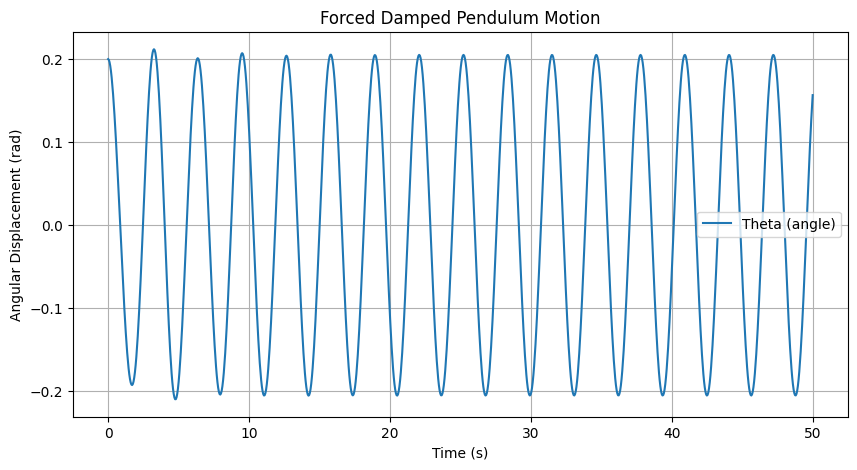
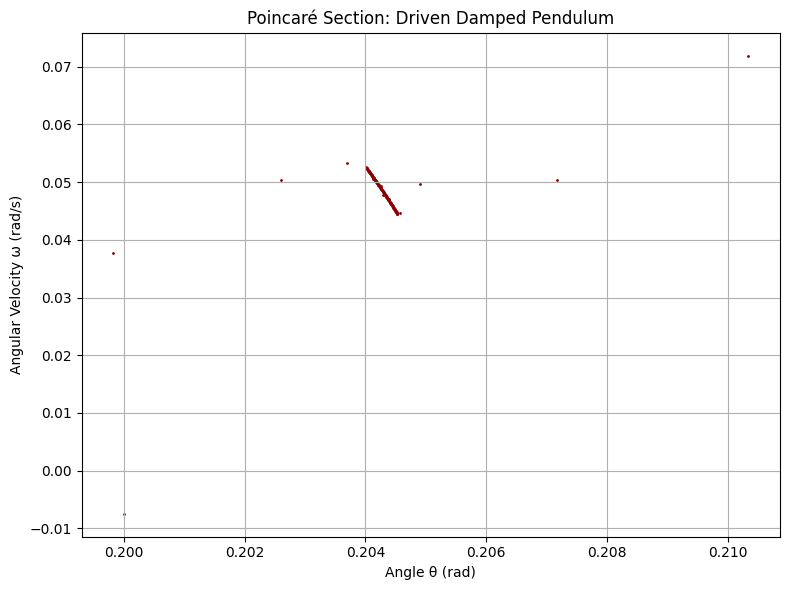
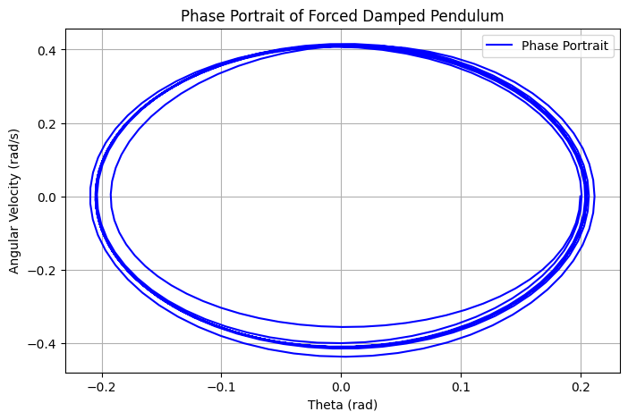

# Problem 2
# **Investigating the Dynamics of a Forced Damped Pendulum**  

## **Introduction & Motivation**  
The **forced damped pendulum** is a fascinating example of how simple physical systems can exhibit highly complex behavior. By introducing both **damping** and an **external periodic force**, this system transitions from predictable harmonic motion to intricate dynamics such as **resonance, quasiperiodic oscillations, and even chaos**.  

Understanding these behaviors is crucial for various real-world applications, from **mechanical oscillators** and **bridge dynamics** to **biomechanics** and **electrical circuits**. This report delves into the governing equations, solutions, and computational simulations to explore the pendulum's rich dynamical landscape.  

## **Theoretical Foundation**  

### **Governing Equation**  
The motion of a forced damped pendulum is governed by the **second-order nonlinear differential equation**:  

$$
\frac{d^2\theta}{dt^2} + b \frac{d\theta}{dt} + \frac{g}{L} \sin\theta = A \cos(\omega t)
$$

where:  
- $\theta$ is the angular displacement,  
- $b$ is the damping coefficient,  
- $g$ is the acceleration due to gravity,  
- $L$ is the length of the pendulum,  
- $A$ is the amplitude of the external forcing, and  
- $\omega$ is the driving frequency.  

### **Small-Angle Approximation**  
For small angles ($\theta \approx 0$), we approximate **$\sin\theta \approx \theta$**, simplifying the equation to:  

$$
\frac{d^2\theta}{dt^2} + b \frac{d\theta}{dt} + \frac{g}{L} \theta = A \cos(\omega t)
$$

This approximation allows analytical solutions, but for **larger angles and chaotic behavior**, numerical methods are required.  

## **Analysis of Dynamics**  

### **Effect of Damping & Driving Forces**  
- **Low damping** ($b \approx 0$) → Near-harmonic motion, with oscillations resembling a simple pendulum.  
- **High damping** ($b \gg 1$) → Motion dies out quickly unless sustained by the external force.  
- **Varying driving amplitude $A$ and frequency $\omega$** leads to **resonance** or **chaotic motion**.  

### **Regular vs. Chaotic Motion**  
By systematically varying parameters, we observe:  
- **Regular Motion:** Predictable oscillations at low forcing amplitudes.  
- **Chaotic Motion:** Sensitive dependence on initial conditions, leading to **unpredictable long-term behavior**.  

A deeper look at these transitions requires **phase portraits** and **Poincaré sections**, which we analyze computationally.  

## **Practical Applications**  

The forced damped pendulum is not just a theoretical construct—it has **real-world significance**, including:  
- **Energy Harvesting**: Capturing oscillatory energy for sustainable power solutions.  
- **Bridge Dynamics**: Preventing resonance-induced collapses (e.g., Tacoma Narrows Bridge).  
- **Biomechanics**: Modeling human gait and posture control.  
- **Electronics**: Analogous to **driven RLC circuits**, influencing circuit resonance and stability.  

## **Implementation & Simulations**  

To visualize the pendulum’s motion under different conditions, we implement a **numerical simulation using Python** with the **Runge-Kutta method**.  

### **Python Code for Simulation**  

```python
import numpy as np
import matplotlib.pyplot as plt
from scipy.integrate import solve_ivp

# Define system parameters
b = 0.5     # Damping coefficient
A = 1.2     # Driving force amplitude
omega = 2.0 # Driving frequency
g = 9.81    # Gravity
L = 1.0     # Pendulum length

# Define the differential equation
def pendulum_eq(t, y):
    theta, omega_t = y
    dtheta_dt = omega_t
    domega_dt = -b * omega_t - (g/L) * np.sin(theta) + A * np.cos(omega * t)
    return [dtheta_dt, domega_dt]

# Initial conditions
y0 = [0.2, 0.0]  # Small initial angle, no initial velocity
t_span = (0, 50) # Time span
t_eval = np.linspace(t_span[0], t_span[1], 1000)

# Solve the ODE
solution = solve_ivp(pendulum_eq, t_span, y0, t_eval=t_eval, method='RK45')

# Plot the results
plt.figure(figsize=(10,5))
plt.plot(solution.t, solution.y[0], label="Theta (angle)")
plt.xlabel("Time (s)")
plt.ylabel("Angular Displacement (rad)")
plt.title("Forced Damped Pendulum Motion")
plt.legend()
plt.grid()
plt.show()
```


## **Advanced Visualization Techniques**  

### **Poincaré section**

```python
import numpy as np
import matplotlib.pyplot as plt

# Parameters
g = 9.81       # gravity
L = 1.0        # pendulum length
b = 0.5        # damping coefficient
A = 1.2        # amplitude of driving force
omega_d = 2.0  # driving frequency

# Time setup
dt = 0.01
T = 2 * np.pi / omega_d  # driving period
steps = 50000
times = np.arange(0, steps*dt, dt)

# Initial conditions
theta = 0.2
omega = 0.0

# Lists to store Poincaré section points
poincare_theta = []
poincare_omega = []

# Integration loop using Euler method
for i, t in enumerate(times):
    # Equations of motion (nonlinear pendulum with driving force)
    omega_dot = -b*omega - (g/L)*np.sin(theta) + A*np.cos(omega_d * t)
    theta += omega * dt
    omega += omega_dot * dt
    
    # Keep theta within [-π, π] for clarity
    theta = (theta + np.pi) % (2 * np.pi) - np.pi

    # Record once per driving period
    if abs((t % T) - 0) < dt:
        poincare_theta.append(theta)
        poincare_omega.append(omega)

# Plotting the Poincaré section
plt.figure(figsize=(8, 6))
plt.scatter(poincare_theta, poincare_omega, s=1, color='darkred')
plt.title("Poincaré Section: Driven Damped Pendulum")
plt.xlabel("Angle θ (rad)")
plt.ylabel("Angular Velocity ω (rad/s)")
plt.grid(True)
plt.tight_layout()
plt.show()
```


### **Phase Portraits**  
Plotting **angular velocity vs. displacement** to observe stable and chaotic regimes.  


```python
import numpy as np
import matplotlib.pyplot as plt
from scipy.integrate import solve_ivp

# Define system parameters
b = 0.5     # Damping coefficient
A = 1.2     # Driving force amplitude
omega = 2.0 # Driving frequency
g = 9.81    # Gravity
L = 1.0     # Pendulum length

# Define the differential equation
def pendulum_eq(t, y):
    theta, omega_t = y
    dtheta_dt = omega_t
    domega_dt = -b * omega_t - (g/L) * np.sin(theta) + A * np.cos(omega * t)
    return [dtheta_dt, domega_dt]

# Initial conditions
y0 = [0.2, 0.0]  # Small initial angle, no initial velocity
t_span = (0, 50) # Time span
t_eval = np.linspace(t_span[0], t_span[1], 1000)

# Solve the ODE
solution = solve_ivp(pendulum_eq, t_span, y0, t_eval=t_eval, method='RK45')

# Plot the phase portrait (Angular Displacement vs. Angular Velocity)
plt.figure(figsize=(8,5))
plt.plot(solution.y[0], solution.y[1], label="Phase Portrait", color='b')
plt.xlabel("Theta (rad)")
plt.ylabel("Angular Velocity (rad/s)")
plt.title("Phase Portrait of Forced Damped Pendulum")
plt.legend()
plt.grid()
plt.show()
```



## **Conclusion**  

The **forced damped pendulum** is a rich and complex system, revealing fascinating physics principles, from **resonance** to **chaos**. By understanding its behavior through **mathematical models** and **computational simulations**, we gain insight into numerous engineering and natural phenomena.  

Further explorations, such as **nonlinear damping** and **bifurcation studies**, will deepen our understanding of **complex dynamical systems**, bridging theoretical physics and real-world applications.  

